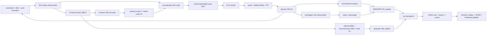
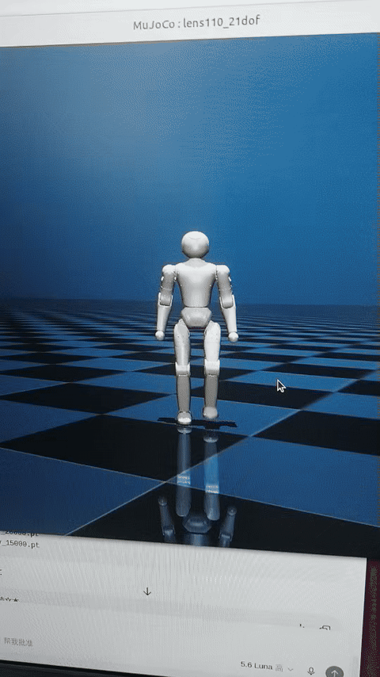

<p align='center'><a href='#zh'>中文</a> | <a href='#en'>English</a></p>
<a id='zh'></a>

# 行走训练架构（DWAQ + PPO + β-VAE）

## PPO、β-VAE 与奖励权重的分工

当前策略由 `DWAQRunner → ActorCriticDWAQ → DWAQPPO` 构建；PPO 优化 actor/critic，β-VAE 通过独立 Adam 更新编码器/解码器。没有配置 AMP 判别器或专家动作模仿损失；腿部周期参考奖励是参数化步态先验，不等同于专家动作数据集。

```text
actor input = [context(3 velocity + 16 latent), policy_obs(76)]
L_RL = L_PPO_clip + 1.0*L_value - 0.008*entropy
L_VAE = 1.0*L_velocity_MSE + 1.0*L_next_observation_MSE + 1.0*KL_latent
LR_RL = LR_VAE = 1e-4 (fixed)
```

这里的 VAE 三项系数是 `1:1:1`，不是各贡献 33.3%：误差尺度不同，终止样本使用 live mask，重建还屏蔽 rollout 最后一步。重建目标实际为下一时刻观测 `o_(t+1)`。当前配置 gamma=0.99、lambda=0.95、clip=0.2，24 rollout steps、5 epochs、4 mini-batches。

环境 reward 仍按下表逐项求加权和，VAE loss 不加入环境回报。盲走上楼梯继承同一网络和权重，课程只改变 terrain row；成功判据是 timeout、无 failure、接近完整 60 s，以及距离出生点的 XY 净位移大于 10 m（20 m patch 长度的一半），并不检测机器人是否沿指定楼梯路径走完一整圈。连续成功两次升阶，失败降阶。

源码相对共享框架 `lens110/legged_lab_lbot/`：`rsl_rl/rsl_rl/algorithms/dwaq_ppo.py`、`rsl_rl/rsl_rl/modules/{actor_critic_dwaq,context_vae}.py`、`source/legged_lab/legged_lab/tasks/locomotion/dwaq/config/lens110/agents/rsl_rl_ppo_cfg.py` 和 `tasks/locomotion/dwaq/mdp/curriculums.py`（tasks 相对同一 legged_lab 包）。独立项目通过 `framework/isaaclab_shared/` 使用共享基座。

English: PPO and VAE have separate optimizers. RL loss is clipped PPO + value - 0.008 entropy; VAE coefficients for velocity MSE, next-observation MSE and latent KL are 1:1:1, not percentage contributions. Both fixed learning rates are 1e-4. Stairs reuse these losses and rewards; promotion tests timeout, no failure, nearly 60 s and more than 10 m XY displacement, not verified completion of the whole stair route.

## 1. 项目定位

本项目是双足人形机器人的盲行走训练链路。它使用 DWAQ（DreamWaQ 风格的历史上下文编码）解决 actor 看不到真实 `base_lin_vel` 时的速度/隐状态估计问题；PPO 负责策略优化，β-VAE 负责从观测历史提取 velocity code 与 latent context。楼梯项目复用本项目的 actor、VAE 和奖励，但有独立的 terrain/curriculum。

| 项目项 | 当前配置 |
|---|---|
| Train task | `LeggedLab-Isaac--DWAQ-Lens110-v0` |
| Play task | `LeggedLab-Isaac--DWAQ-Lens110-PLAY-v0` |
| physics / policy | `500 Hz / 100 Hz`，`sim.dt=0.002`，`decimation=5` |
| episode | `60 s` |
| actor observation | `76` |
| history observation | `5 × 76 = 380` |
| exported policy probe | `obs [1,76]` + `obs_history [1,380]` -> `action [1,21]` |
| action | `21`，双足人形机器人 policy 顺序 |
| command range | x `-0.30..0.35`，y `-0.15..0.15`，yaw rate `-0.6..0.6` |
| policy class | `ActorCriticDWAQ` |
| algorithm class | `DWAQPPO` |

## 2. DWAQ/β-VAE 原理

普通盲行走 actor 只有 IMU、重力方向、关节状态、上一动作和速度指令，无法直接看到仿真中的真实 base linear velocity。DWAQ 将最近 5 帧 actor observation 展平成 `obs_history`，通过 Context VAE 推断两部分上下文：

1. `code_vel`：3 维速度子编码，用真实 `base_lin_vel` 作为训练监督；部署时从历史观测估计速度。
2. `code_latent`：16 维潜变量，表达仅靠当前单帧难以区分的运动/接触上下文。

两部分拼成 `code_dim=19`，与当前 76 维 policy observation 拼接后输入 actor，因此 actor MLP 的有效输入为 `19+76=95`。critic 使用 privileged observation 学 value，但硬件 actor 不接收 privileged 量。

Context VAE 的训练目标是：

```text
h = EncoderMLP(obs_history)
code_vel, code_latent = GaussianHeads(h)
code = [code_vel | code_latent]
reconstruction = DecoderMLP(code)

L_VAE = MSE(code_vel, base_lin_vel_target)
      + MSE(reconstruction, next_policy_obs)
      + beta * KL(q(z|history) || N(0, I))
```

当前 `beta=1.0`。代码对 log variance 做 `[-10, 10]` 限制，并对终止环境/无效 next observation 做 mask。RL 参数和 VAE 参数使用两个 Adam optimizer，避免 VAE 重建梯度直接混入 PPO actor/critic 更新。

## 3. 总体流程图



## 4. 训练框架构成

| 层 | 真实实现 | 作用 |
|---|---|---|
| Environment | Isaac Lab ManagerBased RL + bipedal humanoid robot DWAQ config | 组织 scene、commands、events、rewards、terminations |
| Actor | `ActorCriticDWAQ.actor` | 接收当前 76 维观测和 19 维 context，输出 21 维动作分布 |
| Context | `rsl_rl/modules/context_vae.py` | 从 380 维历史推断速度/latent 并训练重建 |
| Critic | asymmetric privileged critic | 使用训练真值估计 value，部署时不需要 |
| RL algorithm | `rsl_rl/algorithms/dwaq_ppo.py` | PPO clipped surrogate、clipped value、entropy、GAE |
| VAE optimizer | 独立 Adam | velocity MSE、reconstruction MSE、beta-KL |
| Runner | `DWAQRunner` | 组织 `policy`、`critic`、`obs_history`、`velocity` 四个 group |
| Terrain | `LENS110_RANDOM_DWAQ_TERRAINS_CFG` | 生成行走训练地形；本项目不启用 terrain level progression |
| Export | `export_dwaq_onnx_urdf.py` 等 | 固化 policy/history/joint-order 输入输出 |

Agent 配置位于 `source/legged_lab/legged_lab/tasks/locomotion/dwaq/config/lens110/agents/rsl_rl_ppo_cfg.py`；DWAQ 核心模块位于 `rsl_rl/rsl_rl/`。训练 rollout 每个环境使用 `24` steps，PPO 每轮 `5` 个 learning epochs、`4` 个 mini-batches。

## 5. Observation 函数和维度

### 5.1 Actor / history observation

| Observation term | 维度 | 训练函数和含义 |
|---|---:|---|
| `base_ang_vel` | 3 | `mdp.base_ang_vel`，IMU/根部角速度；训练加 `[-0.2,0.2]` 噪声 |
| `projected_gravity` | 3 | `mdp.projected_gravity`，机体系重力方向；训练加 `[-0.05,0.05]` 噪声 |
| `velocity_commands` | 3 | `mdp.generated_commands`，x/y/yaw velocity command |
| `joint_pos` | 21 | `mdp.joint_pos_rel`，相对默认关节位置；训练加 `[-0.01,0.01]` 噪声 |
| `joint_vel` | 21 | `mdp.joint_vel_rel`，相对关节速度；训练加 `[-1.5,1.5]` 噪声 |
| `actions` | 21 | `mdp.last_action`，上一策略动作 |
| `gait_phase` | 4 | `mdp.gait_phase_sin_cos`，左右腿相位的 sin/cos，period `0.6 s`，offset `[0,0.5]` |
| **总计** | **76** | `3+3+3+21+21+21+4` |

`policy` 和 `obs_history` 使用相同的 term 集合；`obs_history` 配置 `history_length=5` 并 concatenate，因此导出输入是 `5×76=380`。历史必须按训练时的 term 顺序和时间顺序堆叠，不能按关节名字重新排序。

### 5.2 Critic privileged observation

critic 包含全部 actor 项，另外加入以下只在训练可用的特权量：

| Privileged term | 内容 | 用途 |
|---|---|---|
| `base_lin_vel` | 真实根部 body-frame 线速度，3 维 | value 学习与 VAE velocity supervision |
| `feet_contact` | 左右 ankle-roll 足端二值接触 | 接触相位/稳定 value |
| `feet_pos` | 左右足 body-frame 位置 | 足端几何和稳定 value |
| `feet_vel` | 左右足 body-frame 速度 | 滑步/接触状态 value |
| `feet_force` | 左右足接触力 | 接触强度 value |
| `root_height` | 根部高度 | 地形和稳定 value |

`velocity` group 单独输出 3 维 `base_lin_vel`，作为 `code_vel` 的监督目标；它不是 actor 输入，也不是部署时必须读取的传感器真值。

## 6. Reward 函数由什么构成

DWAQ 的环境奖励由任务项、稳定项、动力学正则、接触/足端项、姿态先验、生存/终止和 anti-lazy 项组成。环境总奖励为：

```text
R_env(t) = Σ_i weight_i * r_i(t)
r_track = exp(-||tracking_error||² / std²)
```

当前双足人形机器人权重如下：

| 类别 | Reward term | 权重 | 作用 |
|---|---|---:|---|
| 速度跟踪 | `track_lin_vel_xy_exp` | `+2.5` | yaw frame 下跟踪 x/y 指令 |
| 速度跟踪 | `track_ang_vel_z_exp` | `+3.0` | 跟踪 yaw rate |
| 身体稳定 | `lin_vel_z_l2` | `-1.0` | 抑制垂直弹跳 |
| 身体稳定 | `ang_vel_xy_l2` | `-0.05` | 抑制 roll/pitch 角速度 |
| 身体稳定 | `flat_orientation_l2` | `-1.0` | 保持机体平稳 |
| 身体稳定 | `body_orientation_l2` | `-2.0` | 约束 `torso_yaw_link` 姿态 |
| 动力学 | `energy` | `-1e-3` | 抑制能耗/力矩速度组合 |
| 动力学 | `joint_acc_l2` | `-2.5e-7` | 抑制关节加速度 |
| 平滑 | `action_rate_l2` | `-0.01` | 抑制相邻 action 突变 |
| 限位 | `dof_pos_limits` | `-2.0` | 远离软关节限位 |
| 接触 | `undesired_contacts` | `-1.0` | 非足端身体碰撞惩罚 |
| 接触 | `fly` | `-1.0` | 防止双足同时无有效支撑 |
| 足端 | `feet_air_time` | `+0.15` | 鼓励合理摆腿/腾空时间 |
| 足端 | `feet_slide` | `-0.25` | 惩罚接触时脚底滑动 |
| 足端 | `feet_force` | `-3e-3` | 抑制过大足端冲击力 |
| 足端 | `feet_too_near` | `-2.0` | 防止双脚过近/绊倒 |
| 足端 | `feet_heading_alignment` | `-2.0` | 使脚朝向和命令方向一致 |
| 足端 | `feet_stumble` | `-2.0` | 惩罚足端异常碰撞 |
| 姿态 | hip deviation | `-0.3` | 约束髋 yaw/roll 偏离默认姿态 |
| 姿态 | ankle deviation | `-0.2` | 约束踝部姿态 |
| 姿态 | arms deviation | `-0.2` | 约束 torso/肩/肘姿态 |
| 终止 | `termination_penalty` | `-200.0` | 摔倒/失败时强惩罚 |
| 生存 | `alive` | `+0.15` | 未终止时维持存活收益 |
| anti-lazy | `idle_penalty` | `-2.0` | 有命令却不动时惩罚 |
| 腿部先验 | `leg_ref_joint_pos` | `+0.5` | 有命令时约束髋-膝-踝参考轨迹 |
| 步态先验 | `gait_phase_contact` | `+0.2` | 让足端接触匹配左右腿相位 |

这些 reward term 是环境层；DWAQ 的 `velocity MSE`、`reconstruction MSE` 和 `beta*KL` 是算法层 VAE loss，不在 RewardManager 里加权。PPO 的 surrogate/value/entropy 也属于优化器目标，不能和环境 reward 混成一个日志字段。

## 训练权重如何理解 / Interpreting training weights

本文按本仓库当前代码说明训练机制；已有策略的复现参数以对应 run 的 `params/env.yaml`、`params/agent.yaml` 和部署配置为准。奖励混合系数、逐项环境奖励权重、优化器 loss 系数、专家样本比例以及课程采样范围是不同概念。

混合系数可以写成 85%/15% 这样的配置比例，但不能代表训练过程中实际累计奖励贡献；单项 reward 的数值范围、门控、控制步长和出现频率都不同。需要实际贡献占比时，应统计同一 run 中每项加权回报，而不是把配置权重归一化成百分比。

Configuration mixing coefficients are not measured reward contributions. Environment weights, optimizer coefficients, expert sampling and curriculum schedules describe different parts of training. Reproduce a saved policy with its own run snapshots.

## 7. 训练、导出和回放

```text
data/terrain/                 # 训练地形入口
experiments/dwaq_runs/        # TensorBoard、checkpoint、配置快照
exports/training_exports/     # 当前训练窗口导出
exports/packages/             # 可交付 DWAQ 包
docs/REWARD_STRUCTURE.md      # 奖励结构证据
docs/                         # 奖励证据和复现记录
```

训练入口：

```bash
./scripts/train.sh --headless --num_envs 4096
```

ONNX/推理接口必须同时提供当前 `obs` 和历史 `obs_history`；不能只把 `obs` 送给 DWAQ actor。MuJoCo 回放时使用与训练一致的双足人形机器人 XML、关节顺序、500/100 Hz 时序和 action scale。当前 policy probe 目标是 `obs [1,76]`、`obs_history [1,380]`、`action [1,21]`。

## 8. 从 checkpoint 到真机

```mermaid
flowchart TD
  A[.pt checkpoint] --> B[load ActorCriticDWAQ + ContextVAE]
  B --> C[export actor with obs/history interface]
  C --> D[ONNX obs[76] + obs_history[380] -> action[21]]
  D --> E[MuJoCo XML replay]
  E --> F[check gait, contacts, limits, duration]
  F --> G[ROS2 / infer_zero adapter]
  G --> H[real IMU + encoders build the same 76-D terms]
  H --> I[maintain 5-frame history and run policy at 100 Hz]
  I --> J[low-gain supervised hardware test]
```

真机不提供 critic 的 `base_lin_vel`、足端真值接触、足端力等 privileged 观测；这些只用于训练 value 和 VAE supervision。硬件侧必须从 IMU、关节编码器、命令和上一动作构建相同的 actor/history 输入，并保持归一化、关节顺序、动作缩放、限幅、急停和回退路径一致。

## 9. 复现验收清单

- [ ] `policy` 的 76 维 term 顺序与 `obs_history` 的 5 帧堆叠顺序一致。
- [ ] ONNX 两个输入为 `[1,76]` 和 `[1,380]`，输出为 `[1,21]`。
- [ ] actor 未接入 critic privileged `base_lin_vel` 或接触真值。
- [ ] DWAQ code 为 19 维，其中 velocity 3 维、latent 16 维。
- [ ] RL loss 与 VAE loss 使用各自 optimizer，终止/mask 逻辑有效。
- [ ] 环境 reward、PPO loss、VAE loss 在日志里分开记录。
- [ ] MuJoCo 回放使用同一 XML、joint order、四元数和 500/100 Hz 时序。
- [ ] stairs 只在独立项目使用楼梯 terrain/curriculum，不把 stairs checkpoint 当成 flat walk checkpoint。
- [ ] 真机测试具备急停、限位、低增益、人工看护和可回退策略。

## 项目演示



GIF 是 README 直接展示的演示片段；原始 MP4 保留在 `docs/media/walking-demo.mp4` 供下载和复核。

<a id='en'></a>

# Walking Training Architecture (DWAQ + PPO + beta-VAE)

## Scope

This repository trains blind walking for a bipedal humanoid robot. The actor does not receive privileged base linear velocity. A DWAQ `ActorCriticDWAQ` uses a five-frame history of the 76-dimensional policy observation and a Context VAE to infer a 3-dimensional velocity code plus a 16-dimensional latent context. The 19-dimensional code is concatenated with the current observation before the actor MLP.

The verified deployment probe is `obs [1,76]` plus `obs_history [1,380]` to `action [1,21]`. Physics runs at 500 Hz and the policy at 100 Hz. The configured command ranges are x `-0.30..0.35`, y `-0.15..0.15`, and yaw rate `-0.6..0.6`.

## Observation

The actor terms are 3 base angular velocity, 3 projected gravity, 3 velocity-command values, 21 relative joint positions, 21 relative joint velocities, 21 previous actions, and 4 gait-phase sin/cos values, totaling 76. The history encoder receives five such frames, totaling 380. The critic additionally receives privileged base velocity, foot contact, foot position/velocity/force, and root height. A separate 3-dimensional velocity group supervises the VAE and is not a hardware input.

## Reward and optimization

The environment reward contains linear/angular velocity tracking (`+2.5/+3.0`), vertical and angular stability costs, energy/acceleration/action-rate regularization, joint limits, undesired contact and flight penalties, feet air-time/slide/force/spacing/heading/stumble terms, hip/ankle/arm posture terms, termination (`-200`), alive (`+0.15`), idle (`-2.0`), leg reference (`+0.5`), and gait-phase contact (`+0.2`).

These terms are separate from the DWAQ algorithm loss. The VAE loss is velocity MSE plus next-observation reconstruction MSE plus `beta * KL`, with `beta=1.0`; RL and VAE use separate Adam optimizers. PPO uses clipped policy/value objectives and GAE. The VAE decoder is needed for training reconstruction but inference uses the encoder code and current observation.

## Reproduction and deployment

Run `./scripts/train.sh --headless --num_envs 4096` in the local Isaac Lab environment. Record the task, seed, terrain, command ranges, checkpoint, policy/history shapes, joint order, and replay duration. Export both the current observation and the five-frame history input, replay with the same XML and timing in MuJoCo, and only then connect a ROS2/infer_zero adapter. Hardware must reconstruct the same 76-dimensional actor terms from real IMU/encoders and must not depend on privileged critic observations.
